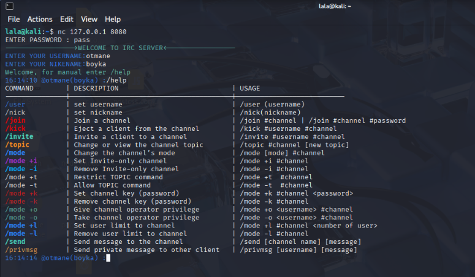

# 🛰️ IRC Server — C++ (1337/42 Project)

A real-time, multi-user IRC server written in modern C++, built as part of the **1337 School** Core Curriculum.

This server supports multiple users, channels, and common IRC commands using non-blocking sockets and the `epoll` event loop mechanism.



---

## 🚀 Features

- 🔌 **Non-blocking sockets** using `epoll`
- 🧑‍🤝‍🧑 Multiple concurrent clients
- 🗨️ Basic IRC protocol support:
  - `/NICK`, `/USER`, `/JOIN`, `/PRIVMSG`
- 🔐 Server password authentication
- 📡 Channel creation and messaging
- 📥 Graceful handling of client disconnects and errors

---

## 🧱 Tech Stack

- **Language**: C++ (C++98 or higher)
- **Networking**: TCP/IP (POSIX sockets)
- **Multiplexing**: `epoll`
- **Compiler**: `g++`
- **Build Tool**: Makefile

---

## ⚙️ Build & Run

### 1. Clone the Repository
```bash
git clone https://github.com/otmane-zerifi/irc.git
cd irc/src
```
### 2. Build the Project
```bash
make
```
### 3. Run the Server
```bash
./irc [PORT] [PASSWORD]
```
💻 Client Instructions
You can connect using:

nc (Netcat)

telnet

GUI clients like WeeChat or HexChat

Example with Netcat:
```bash
nc [localhost] [PORT]
```
